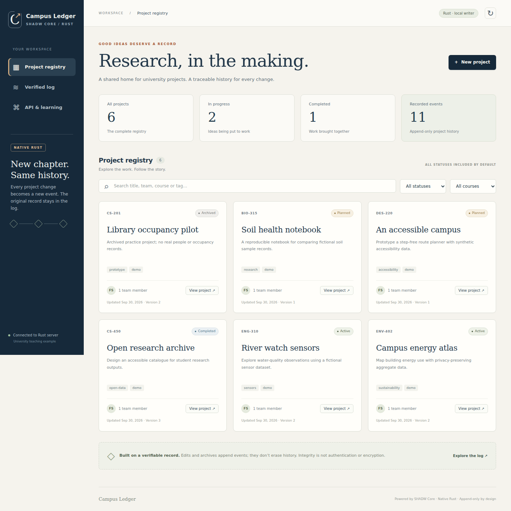
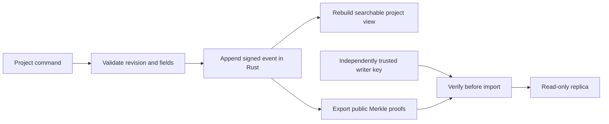

# SHADW Core · Native Rust

A signed, single-writer append-only log in Rust, with **Campus Ledger**, a working
university-project database and local browser app built on its event history.

The Rust implementation runs without Node.js. It reuses the maintained
[`datrs/hypercore`](https://github.com/datrs/hypercore) cryptographic/storage engine
rather than reimplementing cryptography. A bounded vendored persistence patch
is documented in [upstream patch notes](vendor/hypercore/SHADW_PATCHES.md). Project creation, edits and archiving
append new signed events; the searchable current view is rebuilt from verified
history when opened.

> **Scope:** this is an additive Rust-native implementation, not a complete
> line-for-line port of the JavaScript Hypercore 11.37.1 API. Original JavaScript
> source remains intact; its [API documentation](docs/JAVASCRIPT_API.md) is preserved.
> Rust stores and JS11 stores have different disk formats. See the
> [compatibility and security boundaries](docs/rust/COMPATIBILITY.md).



## Run Campus Ledger

Install a current stable [Rust toolchain](https://rustup.rs/) and a native C linker
(e.g. the platform's standard build tools). No Node.js or database server is
required for the Rust application.

```sh
cargo run --locked -p university-demo -- serve --data ./data/university --seed-demo
```

Open **http://127.0.0.1:4192**. The seed flag adds six clearly fictional projects
only when the new writable registry is empty; it never replaces existing history.
Omit it to start an empty registry. Use `--port` to choose another loopback port.
Stop with Ctrl+C and run the same command to reopen the persistent database.

- Create projects; search by title, team, course, supervisor or tag.
- Move planned projects into active work, complete them, or archive them.
- Inspect every revision and run a cryptographic integrity audit.
- Export public signed proof bundles; private signing keys are never exported.
- Open a replica with the same server command for a read-only view.

This is an educational local app: **use fictional data**. Actor names are labels,
not authenticated accounts. The app is single-user/single-writer, binds to
loopback, and has no encryption, multi-tenant access control or production backups.

## Run a complete database/replica example

The parent directory must exist; the requested demo directory must be new.

```sh
cargo run --locked -p university-demo -- demo --data ./campus-example
cargo run --locked -p university-demo -- list --data ./campus-example/writer
cargo run --locked -p university-demo -- verify --data ./campus-example/replica
cargo run --locked -p university-demo -- serve --data ./campus-example/replica --port 4193
```

`demo` creates events, verifies the writer, transfers proofs to a public-key-only
replica, closes/reopens it, and compares the rebuilt projects. It prints only the
public writer identity, never the signing secret. A store is locked exclusively
while open; stop its web server before using another CLI command on that store.

To transfer later changes explicitly, obtain the writer key through a trusted
channel and run:

```sh
cargo run --locked -p university-demo -- replicate \
  --source ./campus-example/writer \
  --destination ./campus-example/replica \
  --writer-key <64-hex-character-public-key>
```

Do not infer trust from a key supplied inside an untrusted bundle. The CLI rejects
a source or destination that does not match the pinned key. A duplicate-only
transfer returns an error rather than pretending new blocks were imported.

## Use the Rust library

The workspace has three small packages:

| Package | Responsibility |
| --- | --- |
| [`shadw-core`](crates/shadw-core) | Native append/get/batch, verified reads, signed proof transfer, audit and persistence |
| [`university-db`](crates/university-db) | Typed project commands, optimistic revisions, event validation and searchable replay |
| [`university-demo`](apps/university-demo) | Loopback HTTP app and command-line examples |

```rust
use shadw_core::Core;
use std::path::Path;

#[tokio::main]
async fn main() -> shadw_core::Result<()> {
let mut writer = Core::create(Path::new("new-writer" )).await?;
let index = writer.append(b"project created").await?;
let trusted_key = writer.public_key(); // Convey this independently.
let bundle = writer.export_bundle(&[index]).await?;
let mut reader = Core::create_replica(Path::new("new-reader"), trusted_key).await?;
reader.import_bundle(&bundle).await?;
assert_eq!(reader.get(index).await?, Some(b"project created".to_vec()));
assert_eq!(reader.audit().await?.verified_blocks, 1);
Ok(())
}
```

Use a path dependency to `crates/shadw-core` or `crates/university-db` from another
local Rust project. No crates.io publication is implied by this repository.

## Verify the implementation

```sh
cargo fmt --all --check
cargo clippy --locked --workspace --all-targets -- -D warnings
cargo test --locked --workspace
```

Tests cover persistence, read-only replicas, sparse proofs, tampered signatures
and bytes, pinned-key rejection, invalid-batch rejection, event replay and
version conflicts. Additional runtime/JavaScript fixture instructions and exact
results are in [Verification](docs/rust/VERIFICATION.md). JavaScript is used only
as an optional compatibility oracle, never as the Rust runtime.

## Design and limits



The public API exposes no truncation or rewriting. Archived projects stay in the
history. Merkle proofs authenticate bytes relative to a writer identity; they do
not prove the content is true or stop a compromised writer from signing bad data.
Full details, transfer limits and failure semantics are in the
[core README](crates/shadw-core/README.md) and
[database README](crates/university-db/README.md). The local HTTP contract is
documented in [API](docs/rust/API.md).

## License and attribution

The original JavaScript Hypercore MIT license and Mathias Buus copyright remain
in [LICENSE](LICENSE); original contributors include Mathias Buus and Andrew
Osheroff. The additive SHADW adapter, database and demo are MIT licensed.
Rust Hypercore and `hypercore_schema` are separately maintained upstream projects,
licensed MIT OR Apache-2.0. See [credits](docs/rust/CREDITS.md).
